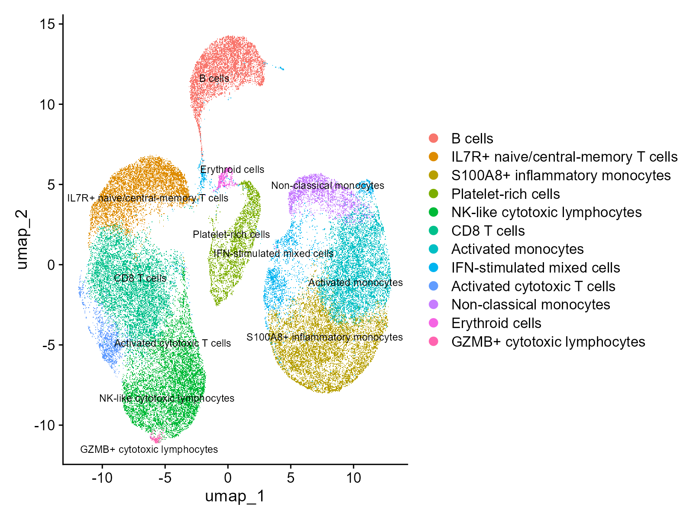
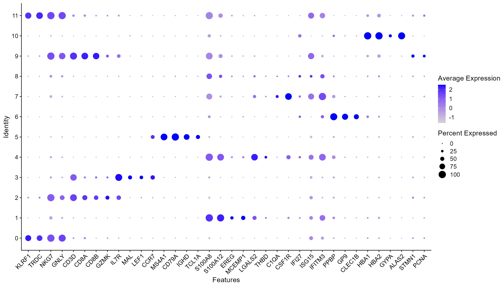
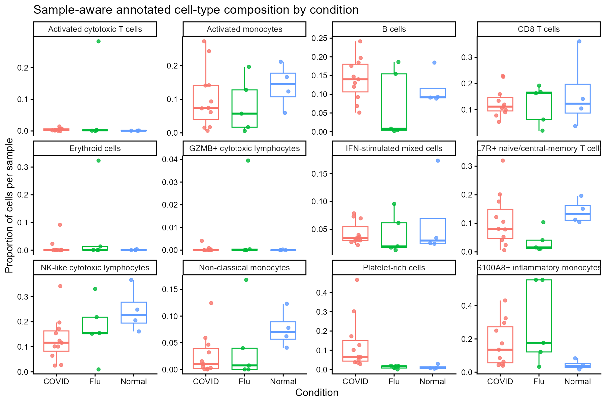

# Single-cell RNA-seq analysis of SARS-CoV-2 PBMC samples

A compact single-cell RNA-seq analysis of GSE149689 PBMCs using Seurat and scDblFinder. The dataset contains 20 libraries: 11 COVID-19, five influenza and four healthy controls. The retained analysis contains 53,380 singlets across 12 annotated clusters, spanning T-cell, B-cell, NK/cytotoxic, monocyte, interferon-stimulated, platelet-rich and erythroid populations.

The primary workflow was rerun successfully end-to-end on 2026-09-06. Because three of the eight COVID-19 patients were sampled twice, library composition is treated descriptively rather than as an independent-donor disease test.

[Run script](analysis/run_analysis.R) · [Analysis notebook](analysis/pbmc_analysis.Rmd) · [Portfolio report](outputs/portfolio.html) · [Figures](outputs/figures) · [Result tables](outputs/tables)

## Key results

- 53,380 singlets retained in the validated historical export
- 12 annotated clusters recovered from the PBMC dataset
- major populations include CD8 T cells, IL7R+ T cells, B cells, inflammatory/activated/non-classical monocytes, NK/cytotoxic lymphocytes and an interferon-stimulated population
- quality control includes feature/count/mitochondrial filtering and library-specific doublet detection with scDblFinder
- clustering uses six principal components and Seurat resolution 0.3
- disease-group composition is shown descriptively because barcode suffixes represent libraries, not independent donors

## Selected figures

### Annotated UMAP



### Canonical marker expression



### Cluster composition by group



## Workflow

```mermaid
flowchart LR
    A[10x count matrix + GEO metadata] --> B[QC filtering]
    B --> C[Library-specific doublet detection]
    C --> D[Gene filtering + normalization]
    D --> E[Variable features + scaling]
    E --> F[PCA]
    F --> G[Graph clustering + UMAP]
    G --> H[Marker discovery]
    H --> I[Annotation review]
    I --> J[Descriptive group composition]
```



## Selected outputs

- [Cluster annotation table](outputs/tables/cluster_annotation_table.csv)
- [Top markers by cluster](outputs/tables/top10_markers_by_cluster.csv)
- [All retained marker results](outputs/tables/all_markers.csv)
- [Cluster composition by group](outputs/tables/cluster_composition_by_group.csv)
- [Cluster composition by sample](outputs/tables/cluster_composition_by_sample.csv)
- [Doublet burden by sample](outputs/tables/doublet_by_sample.csv)

## Repository structure

- `data/` — GEO-derived library metadata, annotation reference and raw-data download instructions
- `analysis/` — run script, R Markdown workflow and small validation helper
- `outputs/` — selected figures, result tables and portfolio report
- `README.md` — project overview and reproduction instructions

## Analysis workflow

The workflow performs sample mapping, QC, sample-aware doublet detection, gene filtering, log normalization, highly-variable-feature selection, scaling, PCA, graph-based clustering, UMAP, marker discovery, annotation review and descriptive cluster-composition summaries.

The annotation safeguard does not reuse cluster numbers blindly: historical labels are transferred only when the complete barcode partition matches the reviewed reference up to a cluster-number permutation.

## Run

Use R 4.5.2 or a compatible recent R installation with these packages available:

`Seurat`, `scDblFinder`, `tidyverse`, `Matrix`, `patchwork`, `SingleR`, `SingleCellExperiment`, `future`, `celldex`, `BiocParallel`, `rmarkdown`, and `knitr`.

Download the GSE149689 supplementary 10x files into `data/raw/` and rename them to:

```text
matrix.mtx.gz
features.tsv.gz
barcodes.tsv.gz
```

Then run:

```sh
Rscript analysis/run_analysis.R data/raw
```

The wrapper renders the documented R Markdown workflow and writes the report to `outputs/pbmc_analysis.html`, figures to `outputs/figures/`, and tables to `outputs/tables/`.

Raw 10x files are intentionally not committed because the sparse matrix is large. See [data/README.md](data/README.md) for the download source.

## Data and source study

GEO accession: [GSE149689](https://www.ncbi.nlm.nih.gov/geo/query/acc.cgi?acc=GSE149689)

Primary study: [Lee et al.](https://pmc.ncbi.nlm.nih.gov/articles/PMC7402635/)

The series contains 11 COVID-19 libraries, five influenza libraries and four healthy controls. The primary study reports eight COVID-19 patients, including three sampled twice. Barcode suffixes are therefore library identifiers and must not be treated as independent donor IDs.

## Technical skills demonstrated

R, Seurat, Bioconductor, scRNA-seq quality control, doublet detection, sparse matrices, PCA, graph-based clustering, UMAP, marker-gene analysis, cell-type annotation, data visualisation, metadata validation, and reproducible R Markdown workflows.

## Limitations

This is a compact descriptive scRNA-seq portfolio project rather than a donor-level disease-comparison study. Repeated COVID-19 sampling means library-level proportions are not independent biological replicates. Cell-type annotations are marker-based and should be interpreted as cluster-level labels rather than absolute cell identities. The optional atlas-sensitivity work from the development repository is intentionally excluded from this portfolio version so the project remains focused on the primary PBMC workflow.

Selected committed figures and tables are retained validated exports; the refactored primary workflow was also completed successfully end-to-end before this portfolio simplification.

Author: James Hughes
